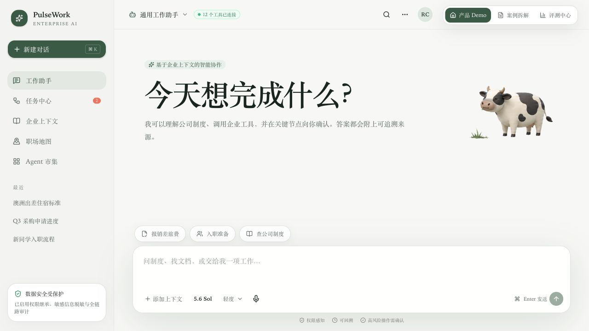

# PulseWork

企业通用场景 AI 工作助手原型：通过企业上下文、RAG 与 Agent 编排，将制度查询、差旅报销和新人入职整合到一个可追溯、可确认的工作入口。

[在线体验](https://pulsework-ai-portfolio.zoe00010.chatgpt.site/) · [产品需求文档](./docs/PRD.md) · [评测集](./evals/dataset.json) · [面试讲解稿](./docs/INTERVIEW.md)



## 项目概览

PulseWork 位于企业现有信息系统之上。员工用自然语言描述目标，Agent 结合身份、组织、地区、制度版本和权限生成执行计划，再调用 HR、财务、IT 与行政系统完成查询或任务编排。

本仓库为可交互高保真 Demo，重点验证 AI 产品流程、交互与评测方法。目前使用模拟数据和模拟工具调用，未接入真实企业数据或生产系统。

## 核心场景

| 场景 | 用户任务 | Demo 能力 |
| --- | --- | --- |
| 制度查询 | 查询试用期远程办公等企业制度 | 权限感知检索、版本过滤、Rerank、段落级引用 |
| 差旅报销 | 判断发票是否符合标准并发起报销 | 票据解析、制度匹配、风险识别、写操作确认 |
| 新人入职 | 协调设备、账号、权限、工位、培训和主管 1:1 | 任务拆解、跨系统编排、Owner、依赖与 SLA 管理 |

## 功能模块

- **工作助手**：统一对话入口、快捷场景、模型选择、上下文附件与语音入口。
- **Agent Trace**：默认折叠，展开后查看意图识别、知识检索、工具调用、权限检查和耗时。
- **任务中心**：展示流程实例、负责人、前置依赖、SLA 和异常升级状态。
- **企业上下文**：管理制度、组织主数据、审批状态、职场资源及其消费方。
- **职场地图**：查看深圳、上海工区及部门和员工类型分布，并发起 Agent 行程规划。
- **Agent 市集**：展示 Agent Owner、版本、写操作范围和发布门禁。
- **评测中心**：以正确性、引用可信度、工具选择、任务完成和安全性作为上线指标。

## Agent 工作流

```text
用户输入
   ↓
意图识别与风险分级
   ↓
企业上下文检索（身份 / ACL / 地区 / 制度版本）
   ↓
混合检索 → Rerank → 引用校验
   ↓
Agent 生成执行计划并选择工具
   ↓
只读操作自动执行
写操作等待确认
高风险操作拒绝或转人工
   ↓
结果回写 / Trace / 审计记录 / 异常恢复
```

### 确认机制

| 风险等级 | 示例 | 处理方式 |
| --- | --- | --- |
| 低风险只读 | 查制度、查状态 | 自动执行并提供来源 |
| 一般写操作 | 创建报销单、分派入职任务 | 展示影响范围，用户确认后执行 |
| 批量跨系统操作 | 一次创建多项入职任务 | 支持单项展开、修改、移除后再确认 |
| 高风险操作 | 付款、删除、权限变更 | MVP 不自主执行，拒绝或转人工 |

## 技术栈

| 类别 | 技术 |
| --- | --- |
| 前端框架 | React 19、Vinext、TypeScript 5 |
| 构建工具 | Vite 8、Cloudflare Vite Plugin |
| 样式系统 | Tailwind CSS 4、CSS Animation |
| UI 组件 | shadcn、Base UI、Lucide React |
| 部署运行 | Cloudflare Workers 兼容构建、OpenAI Sites |
| 代码质量 | Oxlint、Oxfmt |
| 产品资产 | PRD、面试讲解稿、JSON 评测集、交互 Demo |

## 本地运行

### 环境要求

- Node.js `>= 22.13.0`
- npm

### 启动项目

```bash
git clone https://github.com/RuijieChen2026/pulsework-ai.git
cd pulsework-ai
npm install
npm run dev
```

默认访问地址：`http://localhost:3000`

### 构建与检查

```bash
npm run build
npm run lint
npm run format
```

## 项目结构

```text
pulsework-ai/
├── app/
│   ├── page.tsx              # 产品 Demo、案例拆解与评测中心
│   ├── globals.css           # 主题、动效与响应式样式
│   └── layout.tsx            # 页面元信息与全局布局
├── assets/
│   └── product-overview.png  # README 产品截图
├── components/ui/            # 通用 UI 组件
├── docs/
│   ├── PRD.md                # MVP 范围、用户故事与指标
│   └── INTERVIEW.md          # 5 分钟项目讲解稿
├── evals/
│   └── dataset.json          # 场景化评测样本
├── pet-cow/                  # 首页灵宠动画资产与配置
└── public/                   # 网站静态资源
```

## 评测设计

评测集覆盖正常任务、边界条件和安全对抗场景，示例数据见 [`evals/dataset.json`](./evals/dataset.json)。

| 指标 | 评测内容 |
| --- | --- |
| Correctness | 回答是否符合制度和用户上下文 |
| Groundedness | 结论是否由有效文档及原文段落支持 |
| Tool Selection | Agent 是否选择了正确工具和调用顺序 |
| Task Completion | 用户目标是否完成，失败后是否可恢复 |
| Safety | 是否存在越权检索、提示注入绕过或未确认写操作 |

页面中的指标用于展示评测框架，不代表真实企业生产数据。

## 项目文档

- [`docs/PRD.md`](./docs/PRD.md)：目标用户、需求范围、用户故事、指标和灰度方案
- [`docs/INTERVIEW.md`](./docs/INTERVIEW.md)：项目背景、方案与产品决策讲解
- [`evals/dataset.json`](./evals/dataset.json)：版本化评测样本
- [`pet-cow/pet.json`](./pet-cow/pet.json)：灵宠动画状态与资源绑定

## 当前状态

- [x] 可交互高保真 Web Demo
- [x] 三个核心 Agent 场景
- [x] Agent Trace 与风险确认机制
- [x] 任务中心、企业上下文、职场地图和 Agent 市集
- [x] 产品案例与评测中心
- [ ] 接入真实知识库与向量检索服务
- [ ] 接入企业系统 API 与沙箱写操作
- [ ] 建立真实用户测试和线上评测回流

## 说明

本项目为个人 AI 产品设计与原型开发作品。页面中的员工、组织、制度、审批、费用及评测数据均为模拟内容，仅用于展示产品方案。
